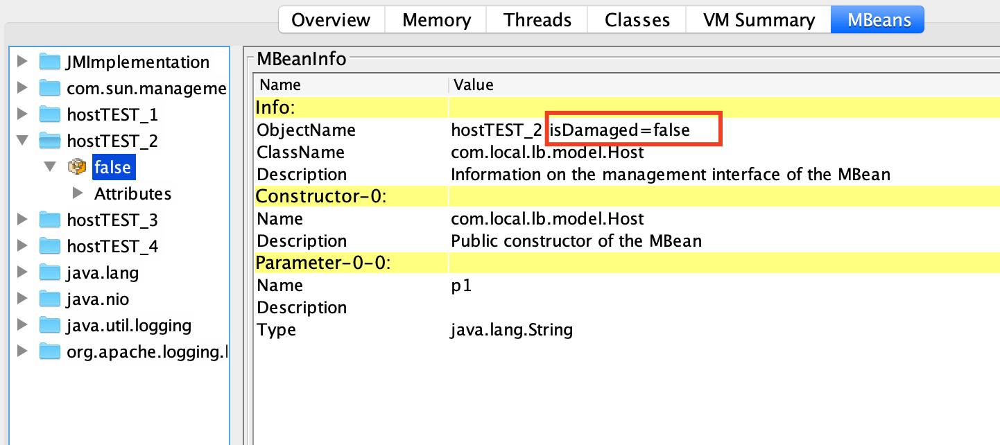

# Load Balancer

Load Balancer skeleton for RoundRobin/PeakFaktor algorythms

## Getting Started

git clone https://github.com/dimmonn/eztask.git


### Prerequisites

jvisual vm/jconsole is needed for demo purposes to be able to manage mbeans


## Running the tests

PeakFactorTest and RoundRobinTest are intended to test  balancing, it actually tests the the balancing happens in a proper order

### Break down into end to end tests

there are 2 group of tests:
1. to test sequential order of requests
2. to test parallel requests 

```
com.local.lb.balancing.algorythm.PeakFactorTest.balanceSequentialTest
com.local.lb.balancing.algorythm.PeakFactorTest.lessThenThreeFourthTest
com.local.lb.balancing.algorythm.PeakFactorTest.moreThenTreeFourth
com.local.lb.balancing.algorythm.RoundRobiinTest.balanceSequentialTest

com.local.lb.balancing.algorythm.RoundRobiinTest.balanceThreadedTest

```
3. suite for all tests

```
com.local.lb.LbTestSuite
```

## Deployment

demo is available within the packages

```
demo.threaded
demo.sequential
```
## Example how to simulate damaged vm
change managed bean property isDamaged to true
 